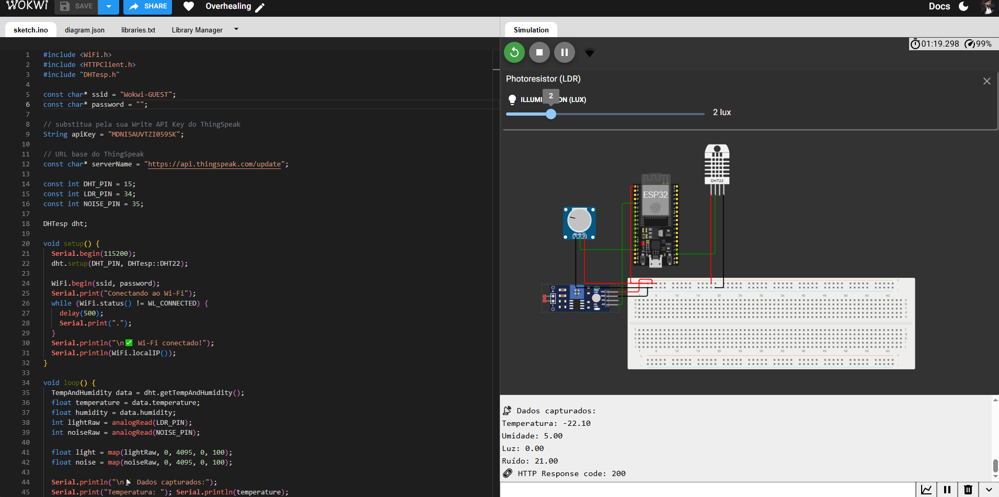

# 🌡️📡 Projeto ESP32 + ThingSpeak — OVERHEALING  
Integração de sensores (temperatura, umidade, luz e ruído) com envio automático para a plataforma ThingSpeak, utilizando ESP32 no simulador Wokwi.

---

## 🎯 Objetivo do Projeto
Criar um sistema capaz de:

- Ler dados de **temperatura e umidade** via DHT22  
- Ler níveis de **luminosidade** via LDR  
- Ler níveis de **ruído** (microfone/entrada analógica)  
- Enviar os dados para a **API do ThingSpeak**  
- Operar completamente dentro do **simulador Wokwi**

Este projeto faz parte do sistema **OVERHEALING**, responsável por monitoramento ambiental e bem-estar.

---

## 🧪 Demonstração (Wokwi)
🔗 Link do projeto no Wokwi:  
**https://wokwi.com/projects/447518142652963841**

---

## 🖼️ Imagens do Circuito

